<div align="center">
  <p></p>
  <h1><code>LOGOMAIN</code></h1>
</div>

<table>
  <tbody><tr><td align="center" width="99999"><div>
    <a href="https://olankens.com">WEBSITE</a> ·
    <a href="https://ko-fi.com/olankens">FUNDING</a>
  </div></td></tr></tbody>
  <tbody><tr><td align="center" width="99999">&nbsp;<div>
    Technology icon pack in SVG with gray icons for clear visibility across light and dark themes, featuring simplified and optimized SVG code for fast, clean, and consistent use across projects and products.
  </div>&nbsp;</td></tr></tbody>
  <tbody><tr><td align="center" width="99999">
    <a href="https://wikipedia.org/wiki/SVG"></a>
    <picture></picture>
    <a href="https://figma.com"></a>
    <picture></picture>
    <a href="https://wikipedia.org/wiki/Bash_(Unix_shell)"></a>
  </td></tr></tbody>
</table>

## PREVIEWS

<table><tbody><tr><td width="99999">
  
</td></tr></tbody></table>

## FEATURES

<!-- START_TABLE -->
<table>
  <tbody><tr>
    <td align="center" width="99999">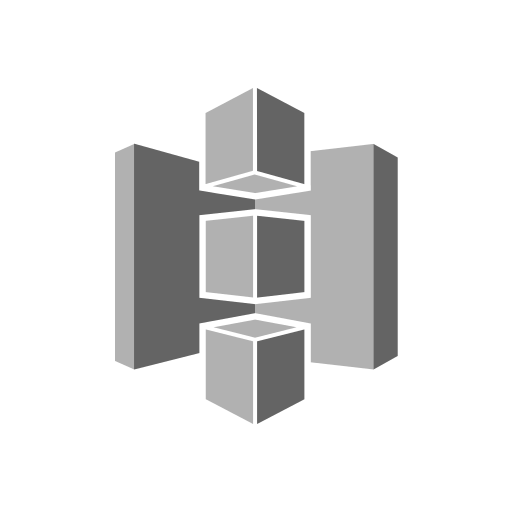</td>
    <td align="center" width="99999"></td>
    <td align="center" width="99999"></td>
    <td align="center" width="99999"></td>
    <td align="center" width="99999">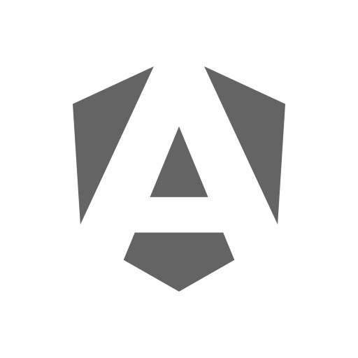</td>
  </tr></tbody>
  <tbody><tr>
    <td align="center" width="99999">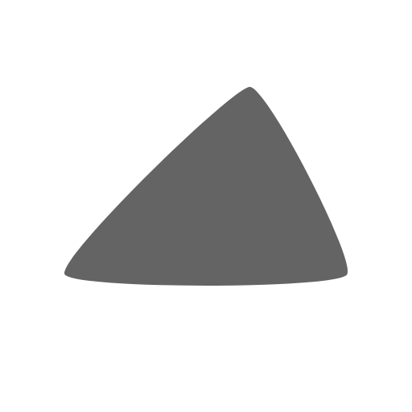</td>
    <td align="center" width="99999"></td>
    <td align="center" width="99999"></td>
    <td align="center" width="99999"></td>
    <td align="center" width="99999"></td>
  </tr></tbody>
  <tbody><tr>
    <td align="center" width="99999"></td>
    <td align="center" width="99999"></td>
    <td align="center" width="99999"></td>
    <td align="center" width="99999"></td>
    <td align="center" width="99999"></td>
  </tr></tbody>
  <tbody><tr>
    <td align="center" width="99999"></td>
    <td align="center" width="99999"></td>
    <td align="center" width="99999"></td>
    <td align="center" width="99999"></td>
    <td align="center" width="99999"></td>
  </tr></tbody>
  <tbody><tr>
    <td align="center" width="99999"></td>
    <td align="center" width="99999"></td>
    <td align="center" width="99999"></td>
    <td align="center" width="99999">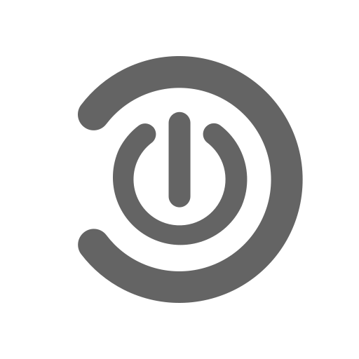</td>
    <td align="center" width="99999">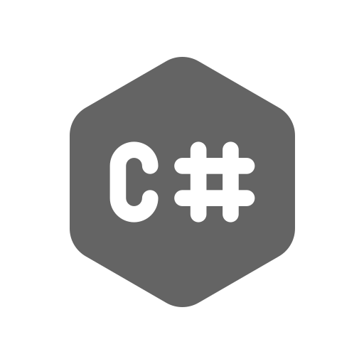</td>
  </tr></tbody>
  <tbody><tr>
    <td align="center" width="99999"></td>
    <td align="center" width="99999"></td>
    <td align="center" width="99999"></td>
    <td align="center" width="99999"></td>
    <td align="center" width="99999"></td>
  </tr></tbody>
  <tbody><tr>
    <td align="center" width="99999"></td>
    <td align="center" width="99999"></td>
    <td align="center" width="99999"></td>
    <td align="center" width="99999"></td>
    <td align="center" width="99999"></td>
  </tr></tbody>
  <tbody><tr>
    <td align="center" width="99999"></td>
    <td align="center" width="99999"></td>
    <td align="center" width="99999"></td>
    <td align="center" width="99999"></td>
    <td align="center" width="99999"></td>
  </tr></tbody>
  <tbody><tr>
    <td align="center" width="99999"></td>
    <td align="center" width="99999">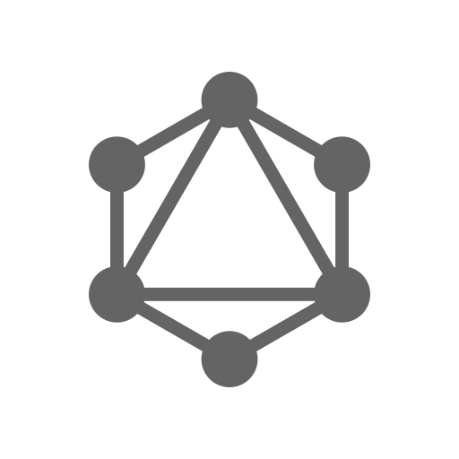</td>
    <td align="center" width="99999">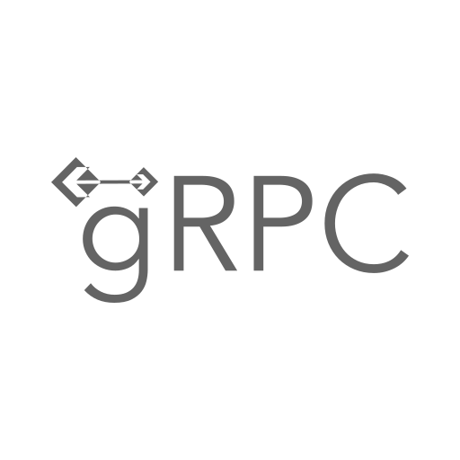</td>
    <td align="center" width="99999"></td>
    <td align="center" width="99999"></td>
  </tr></tbody>
  <tbody><tr>
    <td align="center" width="99999"></td>
    <td align="center" width="99999"></td>
    <td align="center" width="99999"></td>
    <td align="center" width="99999"></td>
    <td align="center" width="99999"></td>
  </tr></tbody>
  <tbody><tr>
    <td align="center" width="99999"></td>
    <td align="center" width="99999"></td>
    <td align="center" width="99999">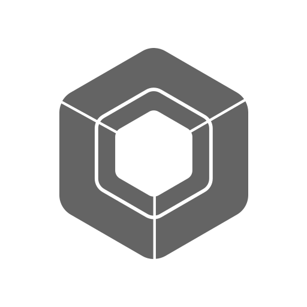</td>
    <td align="center" width="99999"></td>
    <td align="center" width="99999"></td>
  </tr></tbody>
  <tbody><tr>
    <td align="center" width="99999">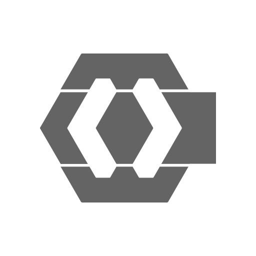</td>
    <td align="center" width="99999"></td>
    <td align="center" width="99999"></td>
    <td align="center" width="99999"></td>
    <td align="center" width="99999"></td>
  </tr></tbody>
  <tbody><tr>
    <td align="center" width="99999"></td>
    <td align="center" width="99999"></td>
    <td align="center" width="99999">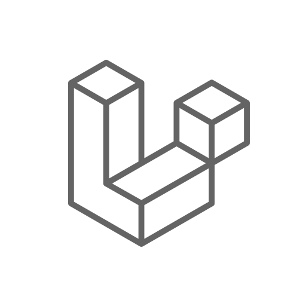</td>
    <td align="center" width="99999"></td>
    <td align="center" width="99999"></td>
  </tr></tbody>
  <tbody><tr>
    <td align="center" width="99999"></td>
    <td align="center" width="99999"></td>
    <td align="center" width="99999"></td>
    <td align="center" width="99999"></td>
    <td align="center" width="99999"></td>
  </tr></tbody>
  <tbody><tr>
    <td align="center" width="99999"></td>
    <td align="center" width="99999"></td>
    <td align="center" width="99999"></td>
    <td align="center" width="99999">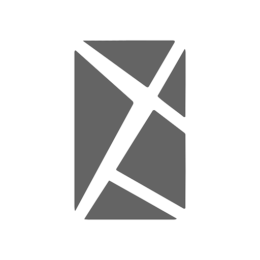</td>
    <td align="center" width="99999"></td>
  </tr></tbody>
  <tbody><tr>
    <td align="center" width="99999"></td>
    <td align="center" width="99999">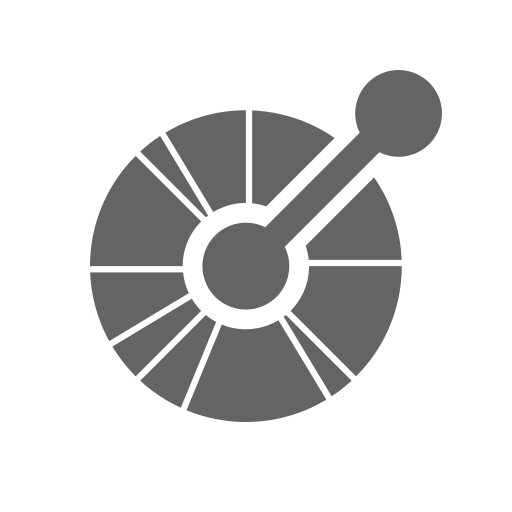</td>
    <td align="center" width="99999"></td>
    <td align="center" width="99999"></td>
    <td align="center" width="99999"></td>
  </tr></tbody>
  <tbody><tr>
    <td align="center" width="99999"></td>
    <td align="center" width="99999"></td>
    <td align="center" width="99999"></td>
    <td align="center" width="99999"></td>
    <td align="center" width="99999"></td>
  </tr></tbody>
  <tbody><tr>
    <td align="center" width="99999">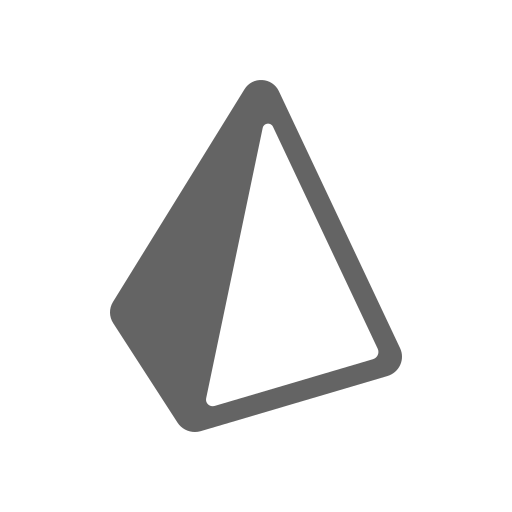</td>
    <td align="center" width="99999">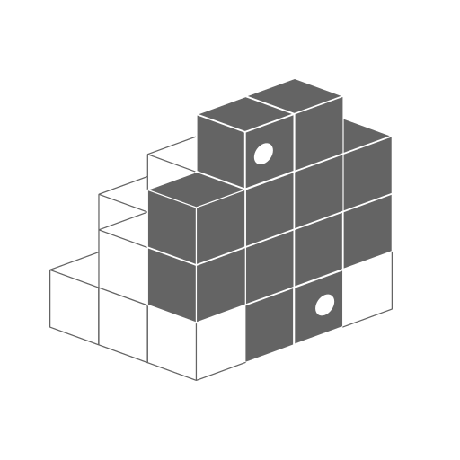</td>
    <td align="center" width="99999"></td>
    <td align="center" width="99999">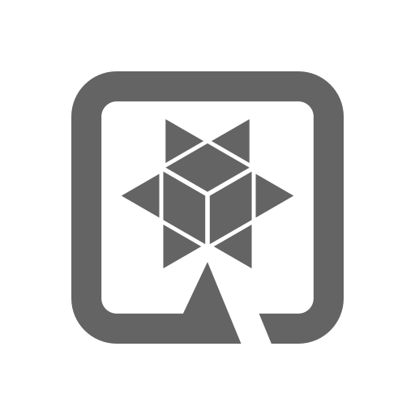</td>
    <td align="center" width="99999"></td>
  </tr></tbody>
  <tbody><tr>
    <td align="center" width="99999"></td>
    <td align="center" width="99999">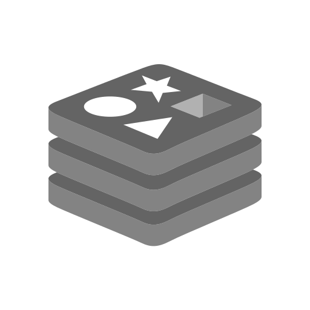</td>
    <td align="center" width="99999"></td>
    <td align="center" width="99999"></td>
    <td align="center" width="99999">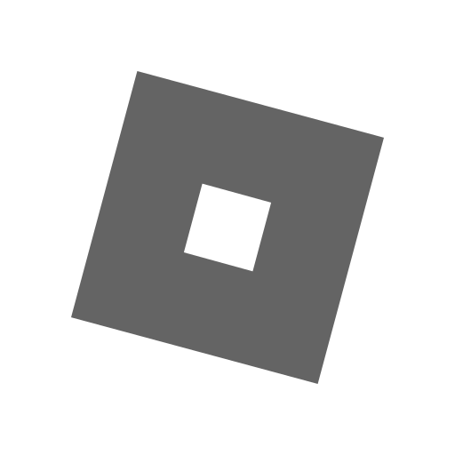</td>
  </tr></tbody>
  <tbody><tr>
    <td align="center" width="99999"></td>
    <td align="center" width="99999"></td>
    <td align="center" width="99999"></td>
    <td align="center" width="99999"></td>
    <td align="center" width="99999"></td>
  </tr></tbody>
  <tbody><tr>
    <td align="center" width="99999"></td>
    <td align="center" width="99999"></td>
    <td align="center" width="99999"></td>
    <td align="center" width="99999"></td>
    <td align="center" width="99999"></td>
  </tr></tbody>
  <tbody><tr>
    <td align="center" width="99999"></td>
    <td align="center" width="99999"></td>
    <td align="center" width="99999"></td>
    <td align="center" width="99999"></td>
    <td align="center" width="99999"></td>
  </tr></tbody>
  <tbody><tr>
    <td align="center" width="99999"></td>
    <td align="center" width="99999"></td>
    <td align="center" width="99999"></td>
    <td align="center" width="99999">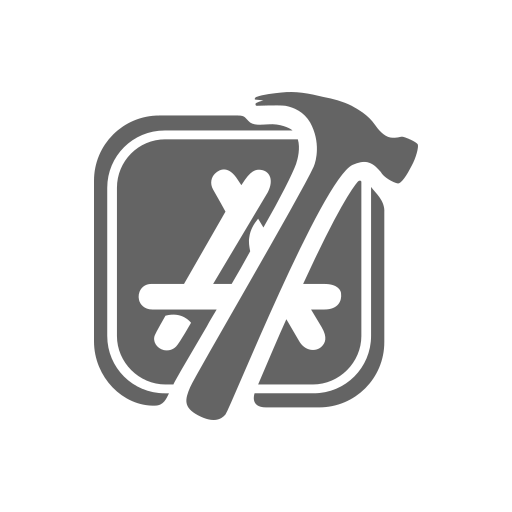</td>
    <td align="center" width="99999"></td>
  </tr></tbody>
  <tbody><tr>
    <td align="center" width="99999">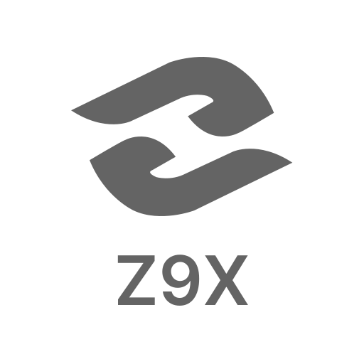</td>
  </tr></tbody>
</table>
<!-- CEASE_TABLE -->

## LEARNING

### BANNER PREVIEW

<table><tr><td align="center" width="99999">
  <a href="https://angular.dev"></a>
  <picture></picture>
  <a href="https://chromium.org/developers"></a>
  <picture></picture>
  <a href="https://kotlinlang.org"></a>
  <picture></picture>
  <a href="https://kubernetes.io"></a>
  <picture></picture>
  <a href="https://spring.io"></a>
</td></tr></table>

### GATHER THE LOGOS

```sh
deposit=".assets" && mkdir -p "$deposit"
baseurl="https://github.com/olankens/logomain/raw/HEAD/source"
for f in {angular,chromium,kotlin,kubernetes,spring}; do
  curl -Lo "$deposit/logo-$f.svg" "$baseurl/$f.svg"
done
```

### GENERATE THE SPLITTER

```sh
magick -size 10x400 xc:"#646464" ".assets/splitter.gif"
```

### CREATE THE BANNER

```md
<table><tr><td align="center" width="99999">
  <a href="https://angular.dev"></a>
  <picture></picture>
  <a href="https://chromium.org/developers"></a>
  <picture></picture>
  <a href="https://kotlinlang.org"></a>
  <picture></picture>
  <a href="https://kubernetes.io"></a>
  <picture></picture>
  <a href="https://spring.io"></a>
</td></tr></table>
```
